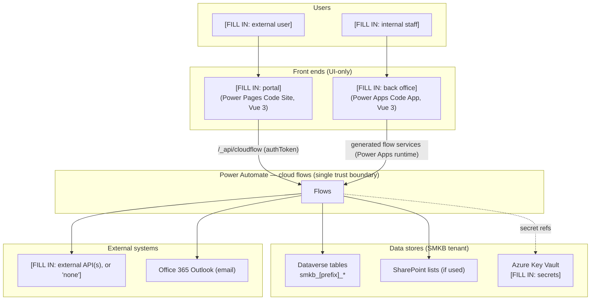
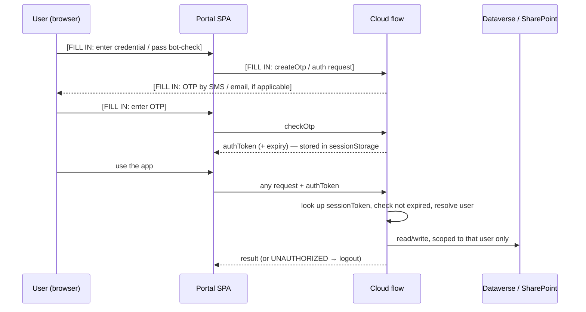

# Architecture

> **TEMPLATE** — fill the `[FILL IN: …]` prompts and diagrams; keep the "Core principle" section. Delete this callout once populated.

## Building blocks

The solution has these layers inside the SMKB Microsoft 365 / Power Platform tenant. `[FILL IN: the rows
for the starters this solution actually activated — delete the ones it doesn't use.]`

| Layer | Component | Repo folder | Runtime |
|---|---|---|---|
| Front end (external) | `[FILL IN: portal name]` — Vue 3 SPA on a **Power Pages Code Site** | `SMKB - [Name] - Power Pages Code Site` | Power Pages |
| Front end (internal) | `[FILL IN: app name]` — Vue 3 SPA as a **Power Apps Code App** | `SMKB - [Name] - Power App` | Power Apps |
| Automation | **`[FILL IN: N]` Power Automate cloud flows** | `SMKB - [Name] - Cloud Flows` | Power Automate |
| Data | **Dataverse tables** (+ SharePoint lists if used) | `SMKB - [Name] - Dataverse Tables` / (SharePoint tenant) | Dataverse / SharePoint Online |
| Config | **`[FILL IN: N]` environment variables** (`[FILL IN: N]` Key Vault secrets) | `SMKB - [Name] - Environmental Variables` | Dataverse env vars / Azure Key Vault |

## Core principle: UI-only front ends, flows-only backend

Both front ends are **UI-only**. They contain no business logic that touches data directly and make **no
direct calls** to Dataverse, SharePoint, or any external API. Every data read/write, every email/SMS, and
every external integration is performed **server-side by a Power Automate cloud flow**, which **re-validates
the caller** before accessing data.

- A Power Pages Code Site portal has **no direct Dataverse Web API client** and **no table permissions** —
  it is flows-only by policy (`src/services/csrf.ts` supplies only the anti-forgery token for the
  cloud-flow call; there is no OData client). *(If a solution genuinely needs the Web API, that is an
  explicit, reviewed exception — see the Power Pages starter's `/ppcs-enable-web-api` skill.)*
- A Power Apps Code App reaches flows exclusively through generated service classes
  (`src/generated/services/*Service.ts`).

This gives the solution a **single server-side trust boundary**: the flows. Table permissions, injection
handling, authorization, and secret access all live there.

## System diagram

`[FILL IN: adapt this skeleton to the real components/flows/data stores/external systems.]`

## Request & authentication flow

The front ends authenticate differently, but both end at the flows, which re-validate every call.

`[FILL IN: adapt to this solution's auth. The OTP + session-token pattern below is the SMKB portal default —
see the Component Library "OTP Auth Screen" recipe. Replace if the portal uses a different scheme.]`

- **Portal (external users):** `[FILL IN: e.g. custom OTP login (phone + one-time code) behind a bot-check;
  short-lived authToken in sessionStorage, re-validated by every flow — not Power Pages OAuth]`. See
  [Security](07-security.md).
- **Back office (staff):** the Power Apps Code App runs inside Power Platform; the signed-in Microsoft
  user's context authorises the bound flow connections. Staff identity (UPN) is read from the unspoofable
  runtime context.

## How the front ends reach the flows

- **Portal →** `POST /_api/cloudflow/v1.0/trigger/{flowGuid}` with the request in `eventData`
  (`src/services/cloudFlow.ts`). Flow GUIDs live in `src/config/flows.ts`; flows are registered in Power
  Pages Studio (Anonymous Users web role — the flow itself enforces auth via the token).
- **Back office →** generated service classes call the bound **Logic flows** connection references
  declared in `power.config.json` (each mapped to a flow GUID).

See [Integrations & Connections](04-integrations-and-connections.md) for the full connector list.

## Deployment topology

Three environments — **Dev → Stage → Production** — all in the SMKB tenant. The **solution** (flows,
tables, env-var definitions, connection references) is promoted through a **Power Platform pipeline**; the
**front-end apps** are built and pushed to each environment separately (Power Apps `code push` / Power
Pages `upload-code-site`). Direct scripted deployment targets **Dev only**; Stage and Prod go through the
pipeline. See [Deployment & ALM](09-deployment-alm.md).
