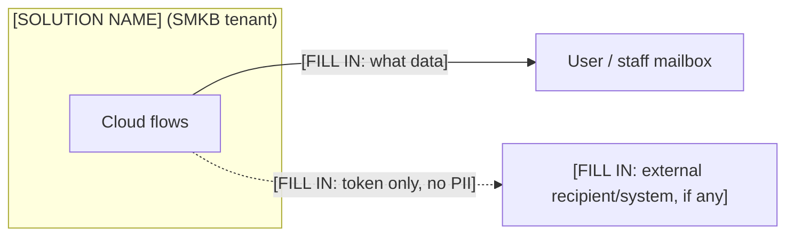

# Data & Privacy

> **TEMPLATE** — keep the section structure and the disclaimer; fill the inventory/egress rows from this
> solution's data model and flows. Delete this callout once populated.

This document is a **factual inventory** of the personal data the solution holds, where it lives, how it is
protected, and every point at which it leaves the system. It is written to support a privacy review by IT;
it makes no legal-compliance determination.

## Personal-data inventory

`[FILL IN: one row per personal-data element. Mark sensitivity (Identifying / Contact / Professional /
**High** financial-or-national-ID / **Secret**) and how it's handled (shown to whom, masked, never returned).]`

| Data element | Where | Sensitivity | Handling |
|---|---|---|---|
| `[FILL IN]` | `[FILL IN: list/table]` | `[FILL IN]` | `[FILL IN]` |
| **Auth secrets** (OTP, session token, expiries) *(if applicable)* | `[FILL IN]` | **Secret** | **Never returned to any client**; used only inside auth flows |

## Data egress — where personal data leaves the system

Personal data leaves only from **cloud flows**, and only through the channels below.

`[FILL IN: adapt the diagram + table to this solution's real egress points. If there is no external egress
beyond email, simplify accordingly.]`

| Egress point | Flow | Recipient | Data sent |
|---|---|---|---|
| `[FILL IN]` | `[FILL IN]` | `[FILL IN]` | `[FILL IN]` |
| Flow-error notice | all flows (`Handle_Flow_Error`) | `smkb_<prefix>_FlowErrorEmails` | Flow name + run ID only — **no personal data** |

**Not egress:** `[FILL IN: e.g. public reference-data lookups send no personal data; a bot-check sends only
the challenge token.]`

## Data minimization at the read boundary

- `[FILL IN: profile/read endpoints return a safe field set — no auth secrets, no raw sensitive numbers.]`
- `[FILL IN: sensitive values (e.g. bank account) are returned masked; the raw value never reaches the browser.]`
- Auth-secret columns are never selected into any client response.

## Access model

| Actor | Can access | Enforced by |
|---|---|---|
| **`[FILL IN: end user]`** | Only their **own** data | Every portal flow re-validates the `authToken` and scopes/ownership-checks by the resolved user |
| **Staff (back office)** | `[FILL IN: operational scope]` | Power Apps runtime — signed-in Microsoft user; bound flow connections |
| **Service account** | `[FILL IN: which lists/tables]` | Runs the flows; not an interactive user |

Users cannot enumerate or reach another user's data: there is no client-side data API, and each flow
restricts results to the caller (see [Security](07-security.md) → authorization).

## Retention & lifecycle signals

`[FILL IN: describe lifecycle states, how long auth secrets live (short-lived), what is retained as an
immutable/audit record, and whether there is any automated deletion. State current behavior factually —
this is not a retention policy.]`
