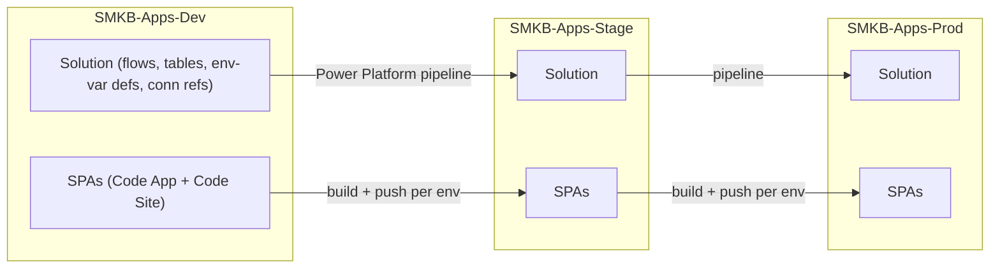

# Deployment & ALM

> **TEMPLATE** — this is the standard SMKB ALM model (keep it). Fill only the `[FILL IN: …]` component rows.
> Delete this callout once populated.

The solution follows a standard Power Platform **Dev → Stage → Production** application-lifecycle model, all
within the SMKB Microsoft 365 tenant.

## Environments

| Environment | URL | How changes get there |
|---|---|---|
| **SMKB-Apps-Dev** | see [`solution.config.json`](../solution.config.json) `targetEnvUrl` | Direct (deploy scripts) — development target |
| **SMKB-Apps-Stage** | — | **Power Platform Pipeline** only |
| **SMKB-Apps-Prod** | — | **Power Platform Pipeline** only |

> **Guardrail:** every direct deploy script hard-codes the Dev URL and **blocks any other target**. Stage and
> Production are never deployed to directly — they are promoted through the pipeline. Enforced in code
> (`deploy.ps1` environment guard) — see [Testing & Quality Gates](08-testing-and-quality-gates.md).

## What is promoted, and how

The solution has **two kinds of artifact** that promote differently:

1. **The solution** (cloud flows, Dataverse tables, environment-variable *definitions*, connection
   references) — packaged as a Power Platform **solution** and promoted **Dev → Stage → Prod through the
   Power Platform pipeline**.
2. **The front-end apps** (Vue SPAs) — **built and pushed to each environment separately**, because a Code
   App / Code Site is not carried inside the solution package:
   - Power Apps Code App: `pnpm pa push` (per environment).
   - Power Pages Code Site: `pac pages upload-code-site` (per environment).



## Solution version — one number, always increasing

**Pipeline promotion requires a monotonically increasing solution version.** A version that goes
backwards is rejected at promotion, which is the worst place to find out: the deploy that caused it
reported success, and nothing between the two says anything is wrong.

Every XML starter in this repo imports into the **same** solution, but each ships its own
`Other/Solution.xml` with its own `<Version>` — so the deployed version is whichever starter imported
last. That is managed here, not by hand:

| | |
|---|---|
| **Source of truth** | [`solution.version.json`](../solution.version.json) at the repo root — **git-tracked**. If it is ignored, every clone resets and the next import regresses. |
| **Who bumps it** | [`scripts/Set-SolutionVersion.ps1`](../scripts/Set-SolutionVersion.ps1), called by each starter's `deploy.ps1` immediately before packing. |
| **How it can't regress** | It reads the live version with `pac solution list` and uses that as the base when it is higher — so a manual bump or a pipeline promotion is picked up automatically. |
| **Segment bumped** | the 4th (revision). A full Dev deploy therefore advances once per activated XML starter. |

Two operational rules:

- **Commit `solution.version.json` after a deploy** — that is what makes the number persist. Init
  Project 8.8 stages it with the other deploy-written values.
- **Rebuilding an existing solution? Seed it before the first deploy.** A fresh repo starts low while
  the live solution may be far ahead. Run `pac solution list`, take the highest version across
  Dev/Stage/Prod, and seed `solution.version.json` above it. The live reconcile normally catches this,
  but only if `pac` is authenticated against the right environment — do not make that the only defence.

Full rationale and failure history: root `CLAUDE.md` → **Critical Rule 7**.

## Deploy commands & gates (Dev)

`[FILL IN: keep the rows for the components this solution activated.]`

| Component | Command | Gates |
|---|---|---|
| Cloud Flows | `powershell -ExecutionPolicy Bypass -File deploy.ps1` | env guard → flow-lint → build zip → `pac solution import` |
| Environmental Variables | `powershell -ExecutionPolicy Bypass -File deploy.ps1` | env guard → placeholder guard → `pac solution import` |
| Dataverse Tables | `powershell -ExecutionPolicy Bypass -File deploy.ps1` | env guard → placeholder + GUID guard → `pac solution import` |
| Power Apps Code App | `powershell -ExecutionPolicy Bypass -File deploy.ps1` | placeholders → env guard → lint → tests → build → `pnpm pa push` |
| Power Pages Code Site | `npm run deploy` | lint → build → `pac pages upload-code-site` |

- **Flows deploy** builds the solution zip manually (PAC cannot pack Cloud Flow JSONs) and imports with
  `--force-overwrite`. Adding a flow requires a `Workflows/*.json` file **and** matching
  `Other/Customizations.xml` (`<Workflow>`) + `Other/Solution.xml` (`RootComponent`) entries — checked by
  flow-lint.
- **PAC auth:** confirm the active profile targets the Dev org before any deploy (`pac auth list`). See
  CLAUDE.md → "PAC CLI Auth Note".

## Per-environment configuration (environment variables)

Environment variables are the **only** place environment-specific values live — nothing is hard-coded in
flows or apps. Definitions travel in the solution; **values are set per environment**. See
[Integrations & Connections](04-integrations-and-connections.md) for the full list.

- **String vars** (URLs, approver emails, support contacts, `EnvironmentName`, `FlowErrorEmails`) — set the
  per-environment value on the environment-variable record in each target.
- **Secret vars** — set an **Azure Key Vault reference**, not a literal value.

### Key Vault secret-reference format

A Secret-type environment variable stores an **Azure Resource ID** of the secret (not the `https://…` vault
URI, and **no** version suffix):

```
/subscriptions/{subscriptionId}/resourceGroups/{resourceGroup}/providers/Microsoft.KeyVault/vaults/{vaultName}/secrets/{secretName}
```

Prerequisites (per the Environmental Variables starter README):
- The **Microsoft.PowerPlatform** resource provider is registered on the subscription.
- The Key Vault grants **"Key Vault Secrets User"** (RBAC) to the person setting the value **and** to the
  Dataverse service principal (App ID `00000007-0000-0000-c000-000000000000`).
- Key Vault and the Power Platform environment are in the **same tenant**; the vault firewall allows access.

The actual secret **value** is never stored in Dataverse or the repo — only this reference. Flows read it via
`RetrieveEnvironmentVariableSecretValue` at run time (see [Security](07-security.md)).

### Production connections (set manually on first promotion)

The pipeline promotes the **solution** (including the connection *references*), but the actual **connections**
each reference binds to in Production are configured **manually on the first pipeline promotion to
Production**, then remain consistent. The **Dataverse** connection is typically a dedicated, least-privilege
service-principal connection; SharePoint/Outlook are dedicated Production connections shared across
solutions. Full identities and the isolation model are in
[Integrations & Connections](04-integrations-and-connections.md).

## Post-deploy notes

- **Flows disabled after import:** a solution import can leave flows **off** until connection references are
  confirmed. Re-enable in the Power Automate portal (Solutions → Cloud Flows → open → confirm connections →
  turn on).
- **Trigger-schema changes deactivate a flow:** if a flow's trigger inputs change, it is **deactivated on
  re-import** and must be turned back on manually.
- **Portal flow registration:** Power Pages flow bindings survive `pac solution import`; a schema change does
  **not** require re-registering the flow in Studio (only genuinely new flows need registration).
- **Code-site bundle caching:** portal bundles use fixed filenames — hard-refresh (or restart the site) after
  a deploy to avoid stale CSS/JS.
